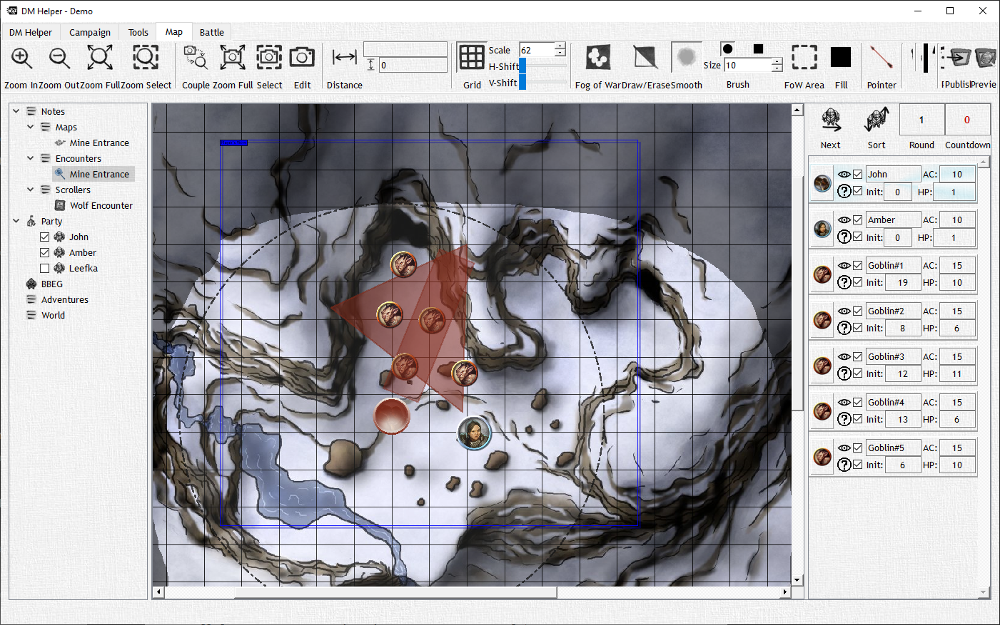

# Combat Scene

**The most important part of a combat scene is the grid size.** Even if you turn off the grid, setting its size is how you tell DMH how “big” the map is. Based on this, tokens are resized, effect sizes are adjusted and distance measurements are calculated. The **Ruler** is a useful way to quickly check the range between two points on the combat map to gauge proper grid scale. Also you can show your players they are just a few feet short of their objective at the end of the round in your chase sequence!

All combatants, objects and effects in the scene can be moved around the map by clicking and dragging them with the mouse. Any time you select a combatant to drag it, a movement circle is shown indicating how far they can move at most. This is just a guideline, but acts as a useful visual aide.

Combatants are added automatically to the middle of the scene as soon as they are added to the initiative order. The size of each token depends on both the size of the combatants (Small, Large, Huge, etc) and the grid size.

In addition to combatants, you can add **Objects** to the combat, which can be added as a token based on an image you provide without anything in the initiative list. You can pick the size of an object, move it around as normal and rotate them by holding the right mouse button just like spell effects! Our favorite use of objects is to move mimics around the map and see if players ever notice before being swallowed whole.
