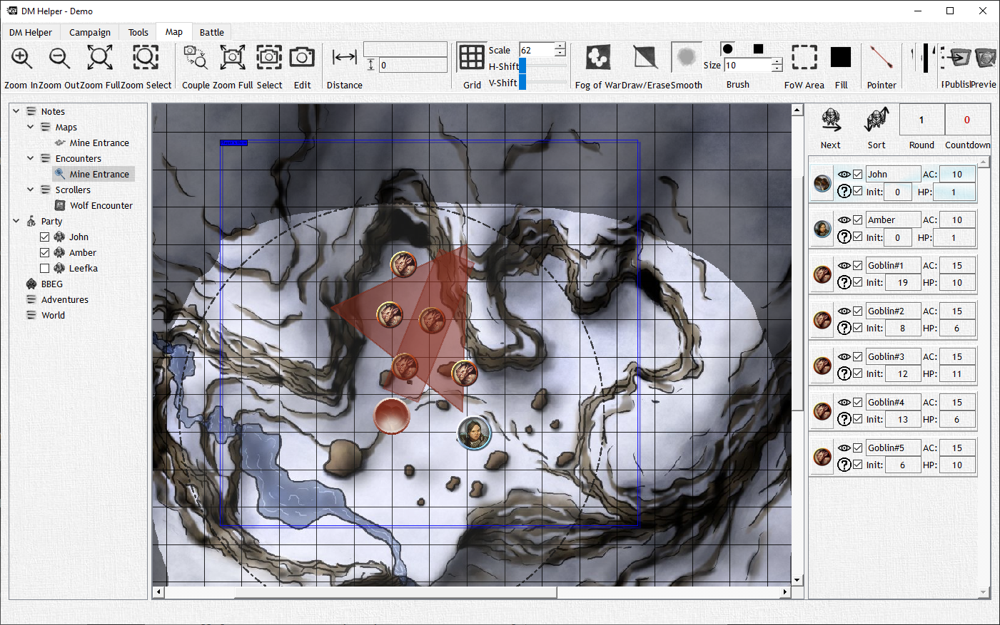

# General Combat View

Generally speaking, you can do everything you need within the combat view (a great change vs previous versions...), including editing the fog of war - even outside of what the players can see, using the pointer or measuring distances.

You need to add a map separately to the campaign before you can add it to the combat. Also, you can only add tokens after you have added a map.
