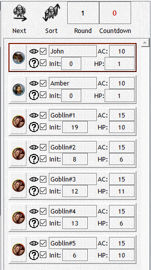

# Initiative List

All player characters, NPCs, and monsters involved in the combat are listed here. You can edit the initiative for each combatant and Sort them in order of initiative; if you don't like the order after sorting, you can fix it by dragging things around in the list. When you create a new combat encounter, all active members of the campaign's party are added automatically, it's up to you to then add the monsters.

Once you have your initiative order together DMH will start at the top of the round which is displayed at the top of the initiative list. You may advance the active combatant by clicking the **Next** button or use the **Next (Ctrl+N)** shortcut to the combatant next in the initiative order. You can also right click on a combatant and click Activate to make them the active player regardless of initiative order.

Speaking of the active combatant, when any combatant receives damage that damage is considered to be dealt by the active combatant. This is important as you can use the **Statistics** function to track damage that all combatants are receiving, dealing, and the average damage dealt per round. This may be useful to pinpoint where your party's main damage source is… also bragging rights for players, hehe.

<!-- markdownlint-disable MD033 Exception to Rule MD033 needed for setting explicit width -->
|                                          Image                                          | Description                                                                                                                                                                                                                                                                                                                                                                                        |
| :-------------------------------------------------------------------------------------: | -------------------------------------------------------------------------------------------------------------------------------------------------------------------------------------------------------------------------------------------------------------------------------------------------------------------------------------------------------------------------------------------------- |
|  | While all combatants are always visible to the DM sometimes you don't want your players to know about what you have lurking in the shadows; and as amazing as the initiative tracker is if they show up there you're ruined! Well don't worry we got you covered, combatants have two states of visibility **Known** and **Visible**; this can be changed using the checkboxes for each combatant. |
<!-- markdownlint-enable MD033 -->

A combatant that is **unknown** to the party is a big secret. They aren’t shown in the initiative order and their tokens are certainly not visible. This is a good way to prepare monsters the party will encounter very soon, but haven’t yet heard them growling.

A combatant that isn’t **Visible** the players generally know about, it is shown in the initiative order (which a generic icon in case they haven’t actually seen it ever), but the token isn’t shown. This makes great for invisible combatants or mindflayers at the top of the cavern that are invading your mind and insulting your combatants' puny intelligence!

<!-- markdownlint-disable MD033 Exception to Rule MD033 needed for setting explicit width -->
|                                     Image                                      | Description                                                                                                                                                                                                                                     |
| :----------------------------------------------------------------------------: | ----------------------------------------------------------------------------------------------------------------------------------------------------------------------------------------------------------------------------------------------- |
|  | As stated earlier Lair Actions are also present, if active, in the initiative order kinda. At the top of the round  you will be reminded to run lair actions with a pop up dialog box, you get the joy of deciding what those are, so go crazy. |
<!-- markdownlint-enable MD033 -->

:::tip

Double-clicking any combatant will open its details page, whether in the DM View for player characters and NPCs or in the Bestiary for monsters.

:::
