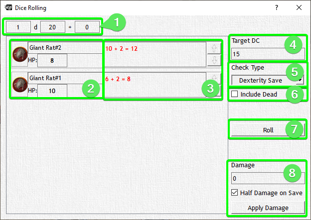

# Spell Effects

Spell Effects can be used for any number of silliness, from the obvious area of a fireball to highlighting zones of danger on the map or just adding semi-transparent color. They can be moved around just like other tokens or rotated by holding the right mouse button.You can create a Radius, Cube, Cone, or Line effect, and any affected targets will highlight in a burgundy color (which you can totally change). Once the spell effect is created you can right click on the effect to edit the effect, delete the effect, or roll a save for every target affected.

When editing an effect (double-click to open the edit dialog), you can choose to make it inactive, so that it does not highlight any combatants in its area, or make it invisible so that your players will not even see it coming.

Once your spell effect is in the proper area, it's time to roll some damage, and lucky for you we've got an app for that? Here is your spell effects save roller? We don't have an official name for it yet ok! Anywho you can roll saves for all combatants affected by the spell effect, apply damage or half damage on a success, and have the combatants applicable modifier applied to the roll!

1. Set the die rolled and static bonus you wish to apply
2. Displays a list of all affected combatants and their HP
3. Displays the roll generated, the combatants bonus, and the total roll in either green or red depending on success/failure
4. Set the target DC for the combatants to meet
5. Select the type of save required (used to apply bonuses from the stat block)
6. Toggle including dead combatants
7. CLICK TO ROLL! Duh.
8. Set the damage dealt to combatants and toggle whether they receive half damage on a successful save or not.

The Spell Roller is super useful in large combats with a ton of combatants.
