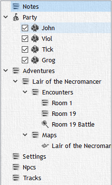

# Flexible Campaign Tree

The flexible campaign tree is a tree structure that holds all the 'objects' of your campaign in it with collapsible headings and subheadings. In a galaxy far, far away and a time forgotten by man this campaign tree had a very specific way that all the objects would be organized. After MONTHS of working tirelessly we created a campaign tree that would assist with world building as well as displaying objects from the campaign!

Here you can create any object and put it in any order you like! Have certain NPCs that only matter to certain quests? Cool nest that NPC under a text object that lists the quest and all it entails. Have an NPC that gives a quest? Great! Nest that quest under that NPC. Are all of these quests in one city? PERFECT! Nest those quests/NPCs under that city! YOU CAN EVEN BREAK DOWN THE CITY INTO DISTRICTS AND NEST THE QUESTS UNDER THOSE SPECIFIC PLACES!!! Sorry… I got excited.

As you can see you can get as detailed or simple as you desire it to be. It is our belief that this flexibility will allow you to use DMH for preplanning a campaign, and complete worldbuilding instead of having to resort to other programs. This falls in line with our mission to make DMH suit any DMs playstyle, and to limit the amount of additional windows and applications that a DM has to have running.

Before you ask, we've gone ten layers deep in the tree before we decided maybe we might be too deep, don't want to get trapped here and not know where we are… I mean I don't want to rely on a top to tell me what's reality or not right!?
