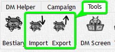
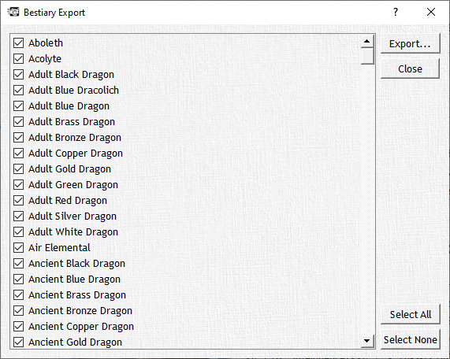
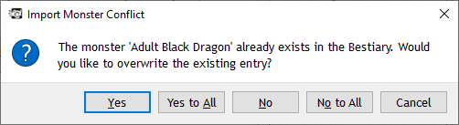

# Export Monsters

If you have created a new Monster and you want to share it with somebody else you can do that with ease.
Click the Export Button and you will get a Window that will show you all Monsters from the currently loaded Bestiary.

Select all the Monsters you want to include in your Export and click "Export…". Choose a Filename and you're done.
You (or somebody else) can now Import the Monster into another Bestiary by clicking Import and choosing the file. Should the loaded Bestiary already have a Monster with the same name it will ask you if it should be overwritten. If you have exported more than just one Monster it will perform the same check for all of them.

You can or course also just click "Yes to All" or "No to All" where every duplicate Monster would be overwritten with the Infos from the File or not respectively.
