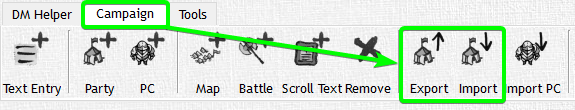

# Export Items from Menu

Select an Item from the Menu and click the Export Button. Choose a filename and you're done exporting.
Sub-Items will be included as well.

In another Campaign select the Item under which you want to import the previously exported Item, click the Import Button, select the file that you created and voila - you got everything right there.

A short word on importing Files into the same campaign they got exported from -> it won't work.
Items need to be identifiable and for that purpose they have a unique ID that you can only see within the XML-File. You can change the _baseID Attribute of the Object you want to import to make it work.

:::caution

Always keep in mind with editing XML-Files directly - be careful and make a Backup so you are able to restore if needed.

:::
