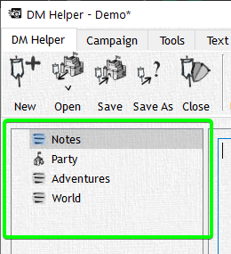

# Campaign Tree

The Campaign Tree is the heart of your world, your characters, encounters, and NPCs; here you will create and organize all of the aforementioned elements for use in your campaign.

Here you will be able to fully flesh out your world with the ability to nest any object (Map, Encounter, NPC, Etc.) under any other object. For instance, let's say your party is on a quest to rescue the daughter of a guildmaster; you can create an adventure labeled as such, then nest maps, NPCs, and Encounters that the party may face under that adventure! This gives you the ability to set up a City in your world, shops they may run into in that city, and NPCs who will be in those shops or cities allowing you to plan for proper encounters and fully develop a world.

More about the Campaign Tree [here](/docs/flexibleCampaignTree)
