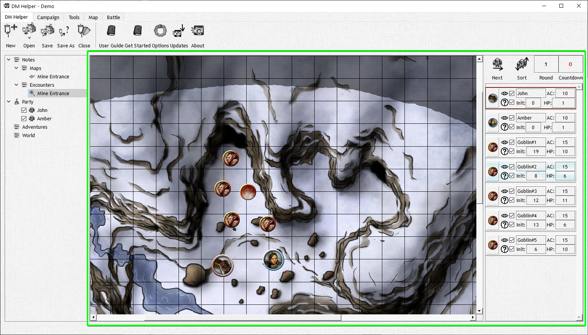

# Combat View

The Combat View allows you to organize and view the combat initiative, while still being able to access map features such as zoom, fog of war, etc. The Combat View is initiated by creating a new batte encounter, or by selecting a combat encounter from the Campaign Tree. Once initiated the ‘Combat/Batte Tab' will appear in the Menu Ribbon and the combat initiative will be displayed; along with some useful info to crush your playe- I mean guide your players on an amazing combat encounter...

The combat view will be used in every combat encounter and give you the ability to track and organize combat in a more effective way. So get to know it intimately, you'll need it for the hell you're gonna put your party through, maybe quite literally hell.

More about the Combat View #TODO add link
