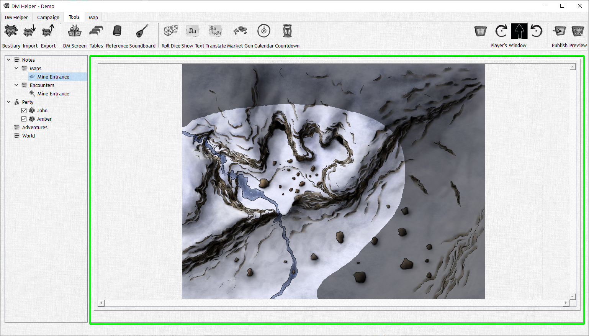

# The DM View

In the DM View you will see all unpublished maps, fog of war updates, Hidden creatures/NPCs, and the combat initiative order.

To clarify all changes you make to your fog of war, maps, creatures, etc are able to be viewed here before allowing your players to see the changes you've made. You can then publish those changes and they will be made viewable in the Player Window, but more on that later.

This ensures that you can get the drop on your party without them knowing, so bring on the secret hordes of Tarrasques you have hidden away after that boss fight your level 4 party barely just beat… I mean no, why would you ever do that?

More about the DM View [here](/docs/category/theDMView)
