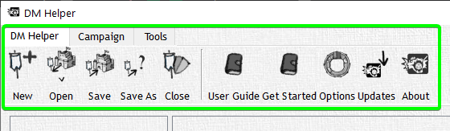

# Menu Ribbon

The Menu Ribbon is the main source of interaction with DM Helper, it will act as a way to navigate all the various tools available to you, or simply save the progress in your campaign so far.

The Menu Ribbon is broken up into multiple tabs, each of these serve as a way to navigate a specific set of functions for DM Helper. Here is a list of all the core tabs; DM Helper, Campaign, and Tools Some tabs will not appear until you need them such as Text, Map, Combat, and Animation; these are tied to certain areas of DMH

Through these tabs you can access and navigate almost every facet of the application.

More about the Menu Ribbon [here](/docs/category/menuRibbon)
