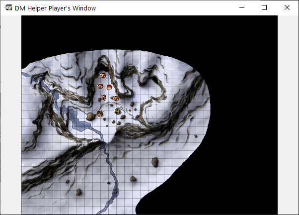

# Player Window

The Player window is the window where all published content is displayed, as well as the current combat initiative turn and following two turns to prepare the players up next for their turn.

As mentioned before this helps create a virtual DM screen to hide all information not known to the players and give them the information they need when you want them to have it. Side note, you can also display text, NPC, player, and creature images to the players here to really mess with their heads.

More about the Player Window #TODO add link
