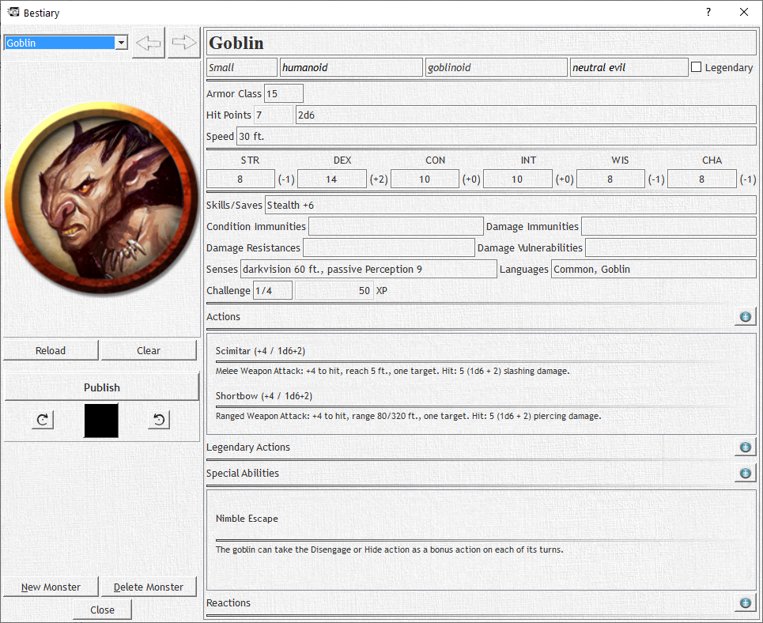

# The Bestiary

The Bestiary is a library of all the monsters you want available to you at any time. The Bestiary by default has all the free SRD content available to any player by Wizards. The Bestiary contains information on all monsters including basic stats, actions, special abilities, and legendary actions! You can also assign your own custom images to each monster that will appear as tokens in Combat. So... PREPARE THE DRACOLICHES!

More about the Bestiary [here](/docs/theBestiary)
