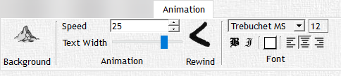

# Animation

The 'Animation' tab is used only while you have a scrolling text object selected in the flexible campaign tree, and is used to help animate text for your players in the player window once published. This tab includes animation controls such as text backgrounds and speed in which it scrolls, along with a full suite of text formatting options.

<!-- markdownlint-disable MD033 Exception to Rule MD033 needed for setting explicit width -->
| Button | Action |
| :---: | --- |
|  | The **Background** button lets you select a background image for the animation. |
|  | The **Speed** control allows you to control how quickly the text scrolls across the screen in the animation. The number you choose is the number of pixels per second the text will move; meaning the resolution of your display will indicated how fast or slow the speed value is. |
|  | The **Text Width** slider lets you set how much of the image is covered by the text, from 10% to 100%. |
|  | The **Rewind** button does what it should, nothing more, nothing less. |
<!-- markdownlint-enable MD033 -->

The set of text format buttons are the same as described in the previous section on the 'Text' tab. Any changes apply to the entire text.
