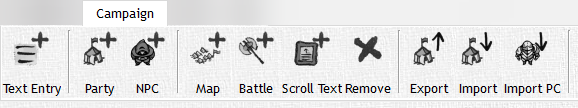

# Campaign

The Campaign Tab gives you control over items in the campaign tree allowing you to import, export, remove and create items in your campaign allowing you ultimate freedom to share any part of your game with anyone you desire.

<!-- markdownlint-disable MD033 Exception to Rule MD033 needed for setting explicit width -->
|                                              Button                                              | Action                                                                                                                                       |
| :----------------------------------------------------------------------------------------------: | -------------------------------------------------------------------------------------------------------------------------------------------- |
|   | **Add Text Entry:**  Add a basic text entry for notes, story plots, descriptions, etc.                                                       |
|                | **Add Party:** Add a new party to your campaign                                                                                              |
|                 | **Add PC/NPC:** Add a new PC or NPC to your campaign with it's own stat profile                                                              |
|                    | **Add Map:** Add a new map for you to edit, and publish to the player window                                                                 |
|              | **Add Combat:** Add a combat encounter to your campaign, this will enter you into Combat View                                                |
|  | **Add Scroll Text:** Add a scrolling text encounter that can be published to the Player Window                                               |
|                     | **Remove:** Simply an option to remove the highlighted item from your campaign tree                                                          |
|                 | **Export:** Export a XML item from your campaign, this can be any object including NPC, Text Entry, Party, Etc. (Excludes Player Characters) |
|                 | **Import:** Import a XML item from your campaign, this can be any object including NPC, Text Entry, Party, Etc. (Excludes Player Characters) |
|         | **Import PC:** Import a Player Character from D\&D Beyond using its share link                                                               |
<!-- markdownlint-enable MD033 -->