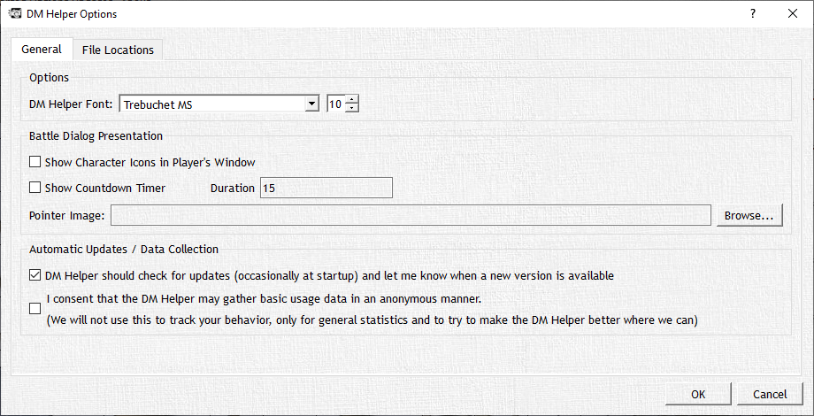
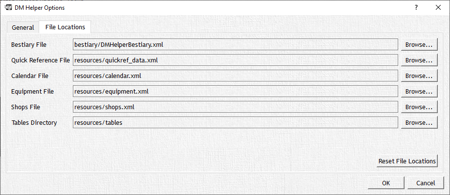

# DMHelper

The DM Helper tab will act similar to your "File" tab in other applications allowing you to create a new campaign, open a campaign, save a campaign, view this document along with the Quick Start guide, check for updates, and access the options menu.

## Options

Most of these items are self explanatory and the basics of any application, but let's take a second to walk you through the options window. Here you will see two tabs General and File Locations; the General tab allows you to customize the overall look and feel of DMH; this is broken down into Options, Combat Dialog Presentation, and Automatic Updates/Data Collection.

### 'Options' Section

- **DM Helper Font:** This allows you to set the font and font size used in DMH

### 'Combat Dialog Presentation' Section

- **Show Character Icons In Players' Window:** Enabling this option shows the player characters' and monsters' icons in the initiative order that is displayed in the right hand side of the Player Window
- **Show Countdown Timer:** Enabling this option allows you to time each turn in initiative if you are really pushing them for time, here you can also set the duration for each turn in any number of seconds.
- **Pointer Image:** This option allows you to change the pointer image for your pointer in the Map, and Combat Views. It is advised to use a bright, visible PNG file that is just a solid object with no background.

### 'Automatic Updates / Data Collection' Section

- **Check For Updates:** Enabling the first option listed in this subheading will automatically check to see if there is a newer version of DMH available. If available a pop up window will appear with a link to download the newest release version available, unless you are a Patreon member in which you will be able to download new pre-release versions.
- **Consent to Gather Usage Data:** Enabling this option gives your consent to allow the DMH team to gather basic usage data, such as general statistics, to try and better DMH where we can. (All information obtained is anonymous, and will not track user behaviors.)

The File Locations tab allows you to customize the location that DMH saves its XML files to which contain all of your campaign information.
