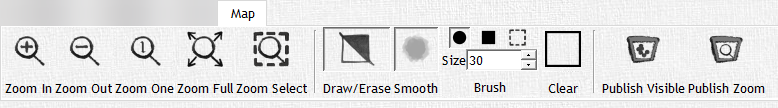

# Map

The 'Map' tab is solely used to manipulate the map and its fog of war. This tab will be one of the most used tabs outside of Combat, and contains some tools you will need to be familiar with in order to utilize DMH. With the level of importance this tab provides, we are going to take an in-depth look into the 'Map' tab and all its facets.

## Zoom Functions

These five buttons are located on the left side of the ribbon under the 'Map' tab, and deal entirely with the level of zoom of your map.

<!-- markdownlint-disable MD033 Exception to Rule MD033 needed for setting explicit width -->
|                                                                                Button                                                                                | Action                                                                                                                                                                                                                                                                                                                          |
| :------------------------------------------------------------------------------------------------------------------------------------------------------------------: | ------------------------------------------------------------------------------------------------------------------------------------------------------------------------------------------------------------------------------------------------------------------------------------------------------------------------------- |
|   | The **Zoom In/Out** buttons allow you to zoom in or out of the map by one unit. They are the first two buttons in the Zoom Functions and are labeled as such.                                                                                                                                                                   |
|                                                                                      | The **Zoom One** button zooms the map into a 1:1 ratio compared to its original size. I.E. you see the image at its full resolution regardless of DMH                                                                                                                                                                           |
|                                                                                     | The **Zoom Full** button brings the image to fill out the entire Map view. This is great for high resolution images/videos that you can sometimes get lost in.                                                                                                                                                                  |
|                                                                                | The **Zoom Select** button allows you to select a square section of the map to zoom into, and automatically resizes the zoom to that area attempting to fit only that selection to the map view. This is useful for large scale maps such as cities like Waterdeep, where parties will need to explore specific areas of a map. |
<!-- markdownlint-enable MD033 -->

## Fog of War Functions

These buttons are located in the middle of your 'Map' tab, and will be used frequently as they control what your players can and cannot see at any given time. These options allow you to add or remove layers of fog of war from the map via a brush, with varying brush options, or selecting large areas at a time. Here are all the fog of war functions in order from left to right:

<!-- markdownlint-disable MD033 Exception to Rule MD033 needed for setting explicit width -->
|                                       Button                                        | Action                                                                                                                                                                                                                             |
| :---------------------------------------------------------------------------------: | ---------------------------------------------------------------------------------------------------------------------------------------------------------------------------------------------------------------------------------- |
|      | The **Fog of War** button toggles FoW editing via brush on or off, and is only visible while in a combat encounter.                                                                                                                |
|  | The **Draw/Erase** button toggles between adding and removing FoW from the map. While the button is recessed the brush will erase existing FoW, and while flush with the ribbon the brush will add FoW to the existing FoW or map. |
|        | The **Smooth** button toggles whether the edges of the brush are gradually blended or hard changes. We suggest using the smoothed version when clearing fog of war with a round brush, particularly in outside areas.              |
<!-- markdownlint-enable MD033 -->

## Brush Options

The Brush Options are an array of buttons that change the brush size and shape.

<!-- markdownlint-disable MD033 Exception to Rule MD033 needed for setting explicit width -->
|                                                                                 Button                                                                                 | Action                                                                                                                                                                                                                |
| :--------------------------------------------------------------------------------------------------------------------------------------------------------------------: | --------------------------------------------------------------------------------------------------------------------------------------------------------------------------------------------------------------------- |
|                 | The **round and square** brush options determine the shape of the brush.                                                                                                                                              |
|                                                                                             | The **size** of the brush can be set in pixels relative to the map size                                                                                                                                               |
|                                                                                         | The **FoW Area** button allows you to change the brush to a square area selection tool, which lets you drag and select a rectangular area of the fog of war to be added or removed.                                   |
|   | **The Fill/Clear** button fills in or removes the whole map of FoW with one click depending on the state of the 'Draw/Erase' button we mentioned previously. So it may appear as Fill or Clear… Oh, oh, oh its magic! |
<!-- markdownlint-enable MD033 -->

## Combat Specific Functions

As stated in our introduction, some items are only visible during combat encounters; the following functions are of that variety.

### The Camera & Camera Options

These four functions are used to control and operate the Camera feature of DMH. The camera allows the DM to maintain a larger image while the players see only what the camera is encompassing on the player window. This allows a DM to have full control over what players do and don't see, and works simultaneously with the fog of war. We've found this especially useful in large combat maps in which you want to set up monsters and NPCs in other parts of the map while the party remains clueless. Silly players, omniscience is not for mere mortals!

:::note

Disclaimer: DMH does not give you omniscience nor god-hood. If you begin having delusions of grandeur while using DMH please see your therapist. Using DMH with alcohol may increase the chance of you experiencing these delusions of grandeur and may cause you to torture innocent D&D players. DMH does not support nor condone treating D&D players as "mere mortals", although we acknowledge their limitations.

:::

<!-- markdownlint-disable MD033 Exception to Rule MD033 needed for setting explicit width -->
|                                       Button                                        | Action                                                                                                                                                                                                                                                                                    |
| :---------------------------------------------------------------------------------: | ----------------------------------------------------------------------------------------------------------------------------------------------------------------------------------------------------------------------------------------------------------------------------------------- |
|  | The **Couple** button toggles linking to the camera frame to the 'DM View' in its entirety, blank space and all. This is great for working on large maps in combat encounters so that the players are only seeing the area you are working in as it will match the zoom level you are in. |
|  | The **Zoom Full** button extends the camera frame to the edges of the map entirely, but not to the full 'DM View'.                                                                                                                                                                        |
|  | The **Select** button allows you to click and drag on an area of the map and create a camera frame equal to that selection.                                                                                                                                                               |
|          | The **Edit** button allows you to move and resize the camera frame manually by clicking inside the frame or the edge of the frame and dragging.                                                                                                                                           |
<!-- markdownlint-enable MD033 -->

:::tip

The Camera Frame is denoted by the blue rectangle in the 'DM View' and by default is sized to the edges of the map as if you selected the Zoom Full button. Players only see what is inside this frame on the 'Player Window'.

:::

### Ruler

The Ruler is used to measure distance on a map from point A to B and can optionally include a vertical distance in its calculations. It is important to accurately set your grid size in the Grid functions before using the Ruler, as distance is calculated based on the current grid size _(See more about grid sizing in the next section)_. The Ruler has four components to it:

<!-- markdownlint-disable MD033 Exception to Rule MD033 needed for setting explicit width -->
|                                         Button                                          | Action                                                                                                                                                                                                            |
| :-------------------------------------------------------------------------------------: | ----------------------------------------------------------------------------------------------------------------------------------------------------------------------------------------------------------------- |
|           | The **Ruler** button toggles the tool on and off; while on the tool allows you to click and drag from one point to another and it will display the distance between those two points.                             |
|            | The **Height** button toggles whether to calculate a vertical height into the measurement displayed by the Ruler. You can set the vertical height difference in the text field to the right of the button itself. |
|  | The **Measurement** Readout is located to the right of the Ruler button and above the Height button; here it will display the measurement calculated by the Ruler.                                                |
<!-- markdownlint-enable MD033 -->

The Ruler is great for measuring distance in an encounter, even if it's the distance it takes for your Air Genasi Monk to levitate himself up to the you placed Beholder at the top of the cavern and commence to performing "dope monk stuff" on your precious mob… What? I'm not salty at all...

### Grid

The grid plays a very important role in DMH - it determines the "scale" of your map in a measurement that DMH uses to determine the sizing of tokens, sizing of spell effects, and distance for the ruler.

<!-- markdownlint-disable MD033 Exception to Rule MD033 needed for setting explicit width -->
|                                   Button                                   | Action                                                                                                                                                                           |
| :------------------------------------------------------------------------: | -------------------------------------------------------------------------------------------------------------------------------------------------------------------------------- |
|   | The **Grid** button toggles the grid lines hidden and visible; we suggest toggling this on to size your grid properly and then you can turn it off if you prefer a cleaner look. |
|      | The **Scale** text field is what determines how much distance is in between each line.                                                                                           |
|  | The **H-Shift** slider allows you to move the grid lines horizontally.                                                                                                           |
|  | The **V-Shift** slider allows you to move the grid lines vertically.                                                                                                             |
<!-- markdownlint-enable MD033 -->

Scaling and Aligning your grid can be useful to align the grid with walls, doors or even a pre-made grid in the premade maps.

### Pointer

<!-- markdownlint-disable MD033 Exception to Rule MD033 needed for setting explicit width -->
|                                 Button                                  | Action                                                                                                                                                                                                                                         |
| :---------------------------------------------------------------------: | ---------------------------------------------------------------------------------------------------------------------------------------------------------------------------------------------------------------------------------------------- |
|  | The **Pointer** button displays a cursor on the 'DM View' that is mirrored to the 'Player Window' making it easy to… Well point at things. By default the Pointer is an arrow, but can be changed in the 'Settings' menu as mentioned earlier. |
<!-- markdownlint-enable MD033 -->

:::note

You can use the pointer on any map by pressing spacebar while mousing over the Preview window.

:::
