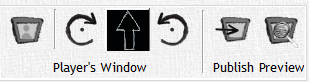

# Player Window & Publish

These options appear in every tab, no matter what content you are viewing from the campaign tree, and give you the ability to publish any item in the campaign tree for your players to view. This also allows you to define the color of your FoW, rotate the orientation of the player window (for all you pimp'in DMs with your recessed TV in the table), apparate a 'Player Window' (again, m a g i c !), and it will display the current orientation of your player window.

<!-- markdownlint-disable MD033 Exception to Rule MD033 needed for setting explicit width -->
|                                                                                              Button                                                                                               | Action                                                                                                                                                                                                                                                                                  |
| :-----------------------------------------------------------------------------------------------------------------------------------------------------------------------------------------------: | --------------------------------------------------------------------------------------------------------------------------------------------------------------------------------------------------------------------------------------------------------------------------------------- |
|                                                                                                        | The **Player Window** button will toggle the player window open and on top of DMH or close the window altogether.                                                                                                                                                                       |
|   | The **Player Window Rotate Left/Right** button allows you to, yep you guessed it, rotate the orientation of the Player Window's contents left or right by 90 degrees.                                                                                                                   |
|                                                                                                                 | The next button we'll call... **Player Window Fog Color Selector & Orientation Indicator**. That's a mouthful. Anyways this button allows you to select the color of the FoW displayed in the player window, and displays an arrow that indicates the orientation of the FoW currently. |
|                       | The **Publish** button is a simple button that displays the items visible in the 'DM View' to the 'Player Window' and displays information hidden by FoW blacked out. This button can be used to publish any item in the 'Campaign Tree' except tracks, for obvious reasons.            |
<!-- markdownlint-enable MD033 -->

There are two **Publish** buttons that appear in the under the Maps tab while selecting a map (not an encounter with a map) to the right of the FoW functions:

<!-- markdownlint-disable MD033 Exception to Rule MD033 needed for setting explicit width -->
|                                    Button                                     | Action                                                                                                                                                                                                                 |
| :---------------------------------------------------------------------------: | ---------------------------------------------------------------------------------------------------------------------------------------------------------------------------------------------------------------------- |
|  | The **Publish Visible** button toggles whether you publish the map in its entirety or just the parts that are visible(not covered by FoW) to the players.                                                              |
|      | The **Publish Zoom** button toggles whether you publish the map in its entirety or just displaying the same zoom level shown in the 'DM View'.                                                                         |
|       | The Preview button allows you to briefly preview what a published 'Player Window' would look like to your players. This is especially helpful if you can't see the display you are outputting your 'Player Window' to. |
<!-- markdownlint-enable MD033 -->
