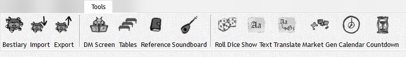

# Tools

The 'Tools' Tab is dedicated to helping you, the DM, manage anything and everything. Look at your DM's table, now look at the 'Tools' tab, now look at your DM table, NOW LOOK AT THE 'TOOLS' TAB!!! Everything that is on your DM table should be here in some way (unless you have really weird things on your table like that weird slimy hand in a jar you have…)! Let's talk about it shall we...

<!-- markdownlint-disable MD033 Exception to Rule MD033 needed for setting explicit width -->
|                                             Button                                             | Action                                                                                                                                                                   |
| :--------------------------------------------------------------------------------------------: | ------------------------------------------------------------------------------------------------------------------------------------------------------------------------ |
|               | **Bestiary:** View your bestiary                                                                                                                                         |
|  | **Bestiary Import:** Import an entire bestiary to add to your collection of monsters                                                                                     |
|  | **Bestiary Export:** Export and share your bestiary as an XML file with anyone                                                                                           |
|              | **DM Screen:** A completely customizable DM Screen that gives you access to information such as inn, food, drink, weapon pricing and so on. Customizable via XML editing |
|                    | **Tables:** View and roll XML based tables to randomly generate events in your game (See more pg X)                                                                      |
|             | **Quick Reference:** View a quick reference table for all player actions, bonus actions, conditions, etc.                                                                |
|           | **Soundboard:** This is a work in progress feature, however it does allow you to play a song from your "tracks" section in the campaign tree                             |
|                  | **Roll Dice:** A dice roller that you can roll any die, any number of them, and add modifiers to along with DC targets to compare to                                     |
|           | **Show Text:** Allows you to publish quick text to the player window                                                                                                     |
|         | **Translate:** Generate text that is coded with a DC check built into it; also allows you to publish the correct translation once the DC is succeeded                    |
|   | **Market Generator:** Generate a random shop inventory based on location and shop types                                                                                  |
|          | **In-Game Calendar:** Track your party's time in the year whether your calender is Gregorian or Harptos                                                                  |
|                 | **Timer:** Create a timer that you can publish to the player window to really light a fire under your party                                                              |
<!-- markdownlint-enable MD033 -->

These tools will become your best friends, and once you fully customize them to your game they will become irreplaceable.
