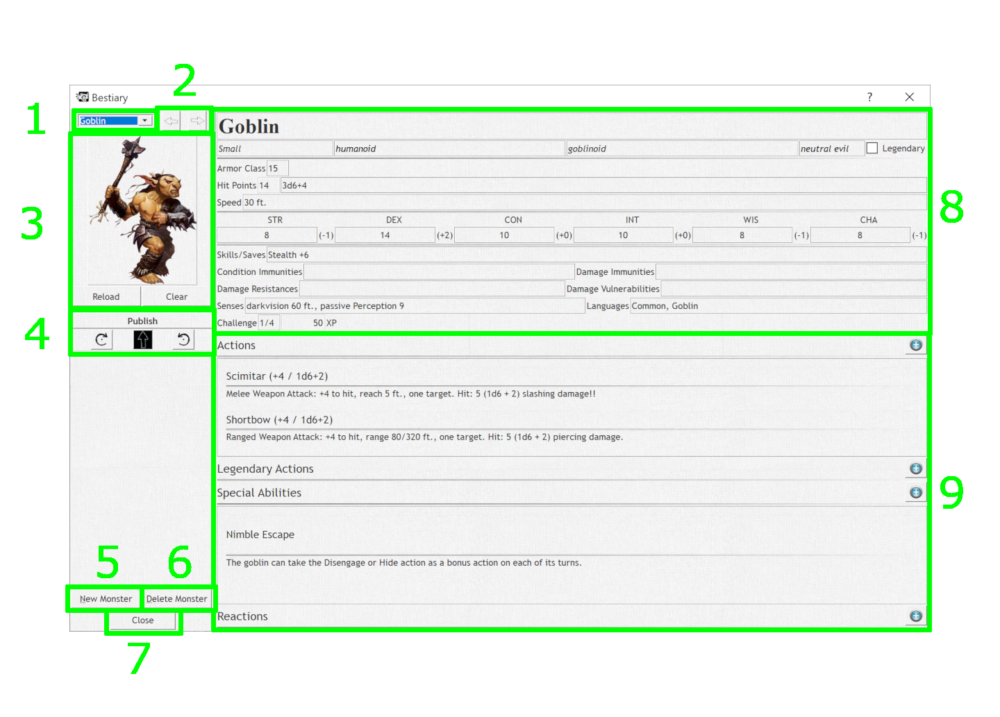
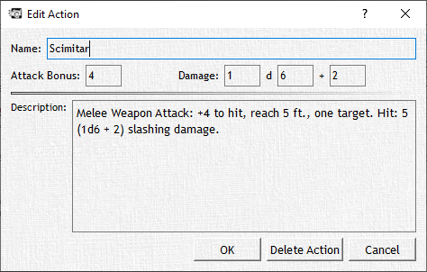

# The Bestiary

The Bestiary contains the full list of creatures and monsters available free to the public SRD provided by Wizards of the Coast. We know that you'd like a full monster manual's worth of monsters in the bestiary however we have to follow the rules set by Wizards about content made for D&D. A side note to that you can import and export custom monsters or whole bestiaries from other users to help fill out your bestiary. In this Bestiary window, you can browse through the existing list, edit individual entries or add new creatures.

**1. Monster selection drop-down**
Here you can select an individual monster in the Bestiary, either through the drop-down box or by typing the name of the monster. The names are listed in the drop-down alphabetically.

**2. Monster selection arrows**
Click to move left/right through the Bestiary as if turning the pages of a book.

**3. Monster image**
This is the image icon used for this specific monster through the DM Helper application. This same icon is also used in combats for visualizing each monster. See the section Combat for further details.

You can set the icon by clicking on the image and select an image file from your system. Once the icon has been set, it's file location will be stored in the back end of DMH (Where the magic happens). To replace it you simply click on the image and select a new image file. We strongly suggest adding monster images to the directory in which the Bestiary is stored or its /Images subdirectory.Both the JPEG and PNG images are supported by DMH; for items that have a transparent background we suggest using the PNG format.

You have two functions located directly below the monster image that work directly with the DMH and the image saved.

- **Reload** button reloads the monster's image.
- **Clear** button removes the monster's image, setting it back to the default image.

**4. Publish functions**
Publishes the monster image in the Player's Window, useful for demonstrating how a monster looks in its full glory to your players! For the details of how the various buttons work, check out the section Publish Functions above.

**5. New Monster button**
Creates a new, blank monster entry. You can copy a monster from another monster - a great way to create zombie versions of your favorite monsters… and everything is nastier when it's a zombie!

**6. Delete Monster button**
Deletes the currently selected monster. **Use with care!**

**7. Close button**
Closes the bestiary dialog.

:::note

This does not unload the Bestiary as it is used by the whole DM Helper application.

:::

**8. Monster Information**
Editable details for the monster. The following individual details have a relevance in other parts of the DM Helper application:

Monster size is used to set the size of monster icons in combat.
Armor Class is shown for reference in the initiative list in combat.
Speed is used to determine the allowed movement distance when "Limit Movement" is selected in combat.
Hit Points / Hit Dice: the average hit points are read-only and are calculated based on the entered hit dice.
Attribute bonuses are calculated based on the given attribute values.
Attributes and skills are used for saving throws when applying area effects in the combat.
The CR of the monster is used to calculate its XP and to evaluate the difficulty level of an encounter.

**9. Ability Lists**
Here Actions, Legendary Actions, Special Abilities and Reactions are all listed along with all their details in their own lists.

You can also edit these actions or add new actions to any monster in the bestiary! Here's how you can do that.

To edit or add an individual action, double-click on the action or . The dialog to the left will appear.

Enter the name, the attack bonus to add to a hit, and the damage dealt if the action strikes true in the [# Of Dice] [Type of Die] + [Bonus Damage]. Example: 2 d12 + 5

Lastly enter a description of the action, this is especially helpful if an action requires a save, or condition.

You can also easily delete an action, by double-clicking on it to open the edit dialog and click the "Delete Action" button.
