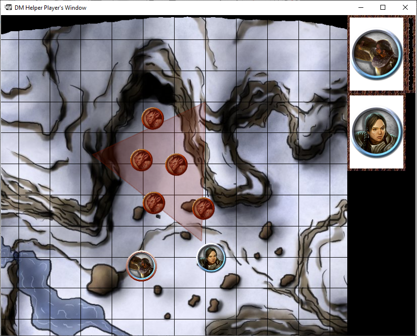

# The Players Window

The player window is used to display information that you as a DM wish for your players to see without revealing hidden objects. If you've ever played IRL and made this awesome combat map, covered it with black construction paper layered perfectly in order of how your players should explore the map so that they only see what their characters see, you are familiar with the concept. Except now when your players decide to go the most unorthodox route of exploring, you no longer have to struggle removing those pieces of black construction paper and accidentally revealing more than you wanted to! We've all been there once. Now imagine instead of just displaying a map you can show them letters, book entries, player/NPC/monster images up close, player descriptions, in depth lore you wrote for HOURS that you usually wouldn't bother to write out a second time, all that and more is available to display to your players here! Just remember kids the sky's the limit, well, your imagination is the limit here. There are just a couple of things worth noting about the player window.

## Initiative Tracker

When engaged in a combat encounter the player window displays a small bar, by default on the right side of the window, that displays the active player/mob, the next two players/mobs in the initiative order, and a timer that you can set to whatever time limit you wish in the form of a small green bar that runs down as time passes.  This lets the players know whose turn it is, who needs to prepare to go next or whether to clench the butt cheeks for the oncoming onslaught, and how much time they have left to take their turn if you're into that kind of thing.

## Everything else

Vague header I know… Really though every other object in the campaign tree can be published here. What you don't believe me? Ok fine bulleted lists it is!

- Maps, only the revealed parts.
- Player, Monster, NPC images
- Text
  - Use this to display lore, quests, descriptions, loot, etc. (I M A G I N A T I O N ! ! !)
- Animated Text
  - You can use this to display images of weapons, amor, magical items, etc as the "background" (I M A G I N A T I O N ! ! !)

SEE! Everything else. Seriously though get creative with how to use the items and how they interact with the player window, and you can almost do anything in DMH.

## How do I utilize the player window?

So now you know how amazing the player window is, and how it is the central focus of DMH as a whole. The question remains how do you leverage all that? I mean you can't use your monitor and display it at the same time. Well here's a few ways you show it to your players?

- You can attach a second monitor to your computer and point it at your players
- You can use a TV somewhere in your house that you can link your PC up to and then move the Player Window to it.
- You can build a gaming table with a TV recessed into it; for this sort of setup, the rotation of published content can be really useful
- You can play over the web by sharing the player window with your favorite streaming service such as Zoom, Skype, Discord, Hangouts, etc.
- You can use broadcasting software (OBS, XSplit, etc) to stream both the DM View and player window to an audience.

There are a plethora of ways to integrate the player window into your games, if you come up with anything creative, drop in discord and let us know! Regardless of how you are sharing your Player's Window, one very useful feature of it is the 'F' key. If you press 'F' on the Player's Window, it switches into fullscreen mode, not to be confused with "Press F to pay respects".

The Player's Window is the whole point of DMH. OK, so we said that about the Publish button too, but only because the Publish button is how you send things to the Player's Window… and the Player's Window is ***the thing*** you show to your players.

:::note

To be fair to all the other cool features, there's actually a lot of useful stuff that DMH does for you that is not specifically targeted at publishing for players. Still, we love publishing.

:::

The controls around publishing to the Player's Window are described on page #TODO add link
