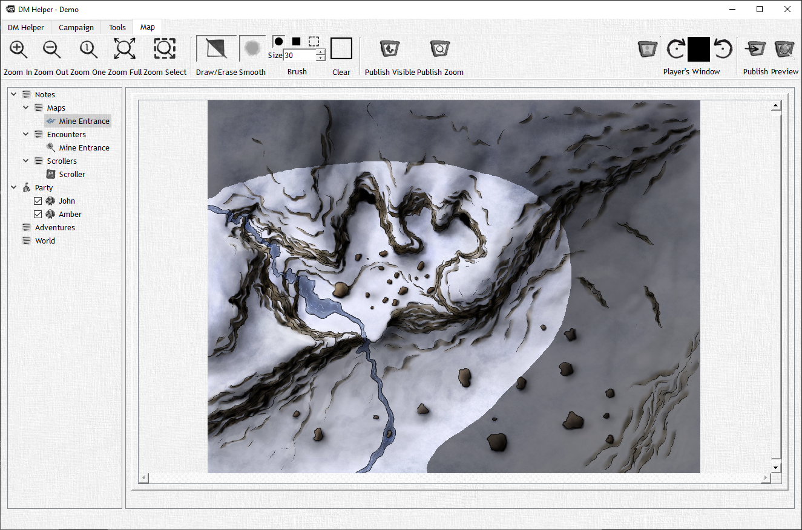

# Maps

The DM View allows you to view maps you have imported into your campaign, by default these maps are covered in fog of war which is displayed by an opaque grey layer over the map image. Overall you will still see your map in its entirety, however this opaque grey layer appears as black to the players in the player window or "fog". This allows the DM to edit the FoW and place mobs safely without the players being able to see.
