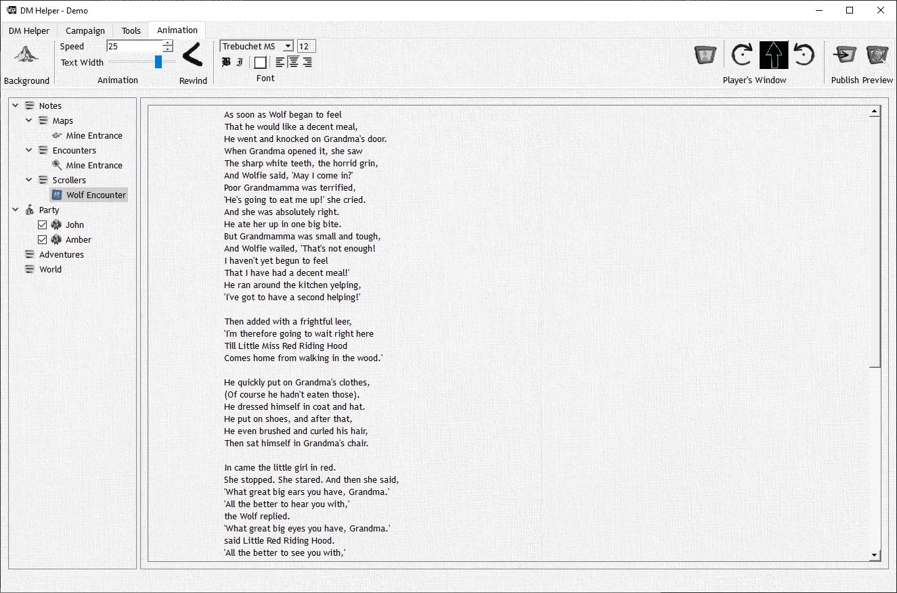

# Scrolling Text

Scrolling text is an easy-to-use way to create animated cutscenes. All you need is an attractive background (image or video!) and an engaging text for your players and DMH takes care of the rest.

The DM's View gives you a preview of how the scrolling text will look on top of the selected background. You can use this to check whether the selected font and text color are well visible on top of the background. The text can be formatted and the animation controlled using the various entries on the "Animation" tab.

Like everything else in DMH, to start the animation and show the scrolling text, all you have to do is Publish.

:::note

Starting with v2.0 of DMH, the scrolling text is published directly to the Player's Window rather than into its own publish window.

:::
