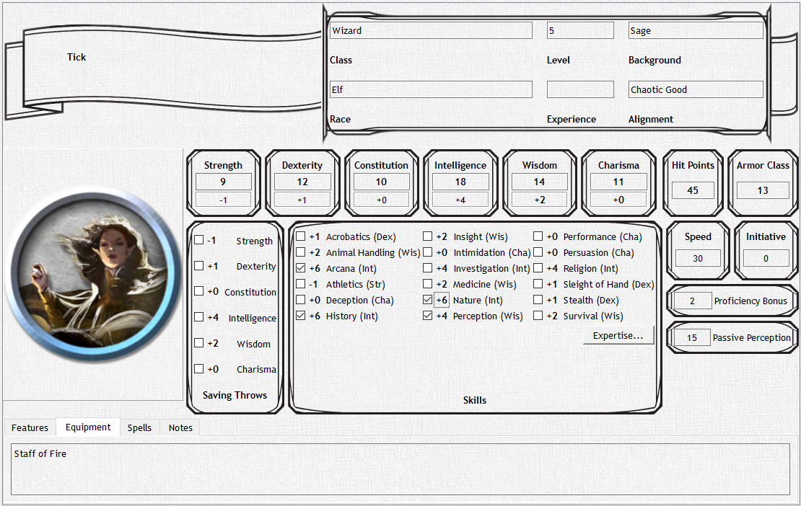

# Characters & Character Sheets

Characters that are in a party are treated as PCs, all other characters are NPCs. Each character object has a character sheet that was inspired by the very paper character sheet used in 5e! Certain values are calculated as they are supposed to be from your core six stats such as saves, skills, passive stats, etc. All relevant information that one could ever need to know about a character is listed here.

You can create a character by entering all of their data by hand or copy the character details based from a creature in the bestiary. The character sheet is the same for both NPCs and PCs as they function similar to each other. There's nothing like having a player retire a PC in your campaign and making him an NPC. You can make this change from a PC to an NPC or vice versa easily by dragging them in or out of a party.
