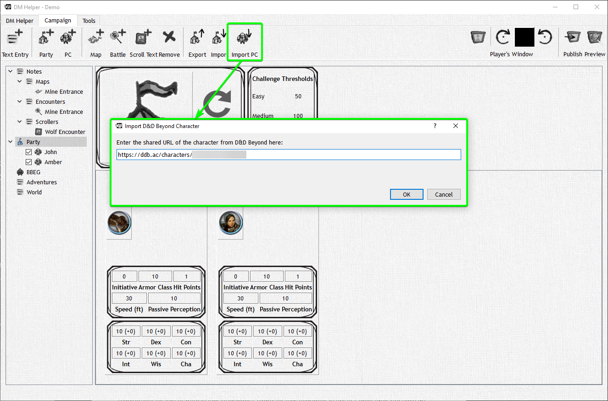

# D&D Beyond Import

If you click on the ‘Import PC' button, you can enter a link to a public character on D&D Beyond, DMH will automatically import the character data, and ask you if you would like to download and import1 the character icon as well.

If a character has been imported from D&D Beyond, you can update it at any time with a simple click of the "D&D Beyond Sync" button.

<!-- markdownlint-disable MD033 Exception to Rule MD033 needed for setting explicit width -->
|                                              Button                                               | Action                                                                                             |
| :-----------------------------------------------------------------------------------------------: | -------------------------------------------------------------------------------------------------- |
|  | In fact, on a party view, you can even update all the characters in the party with a single click. |
<!-- markdownlint-enable MD033 -->
