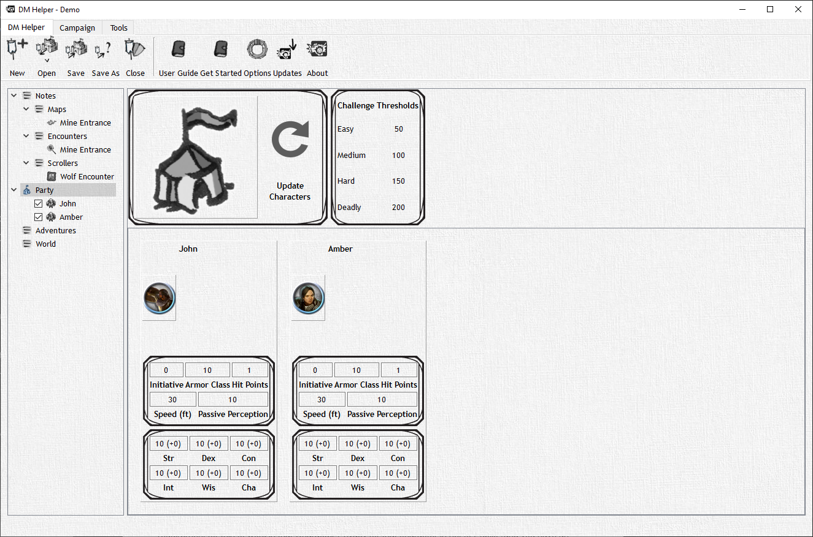

# Party View

A party is intended to be a collection of friends and heroes, but occasionally they just devolve into a bunch of people doing whatever they want! Party View allows you to view all the PCs/NPCs/monsters that are in your party, and an overview of all their basic stats should you need them.

In Party View you can party can be given a token image, in an upcoming version of DMH you will be able to use this token to show the location of the party with a single icon on maps; this will be useful for those overland maps of the continent you made! The party view also gives you an overview of the characters in the party, as a useful quick reference.

Party members can be active or inactive, the difference being active party members are automatically placed into the initiative order when engaged in a combat encounter. Inactive party members can easily be added via the Combat tab while in a combat encounter so you don't have to create a stat block from thin air every time you need it.

We've found it useful to add objects such as Spiritual Weapon and Familiars as NPCs under their respective characters as inactive; this way they won't automatically be in the initiative list but are easily added.
