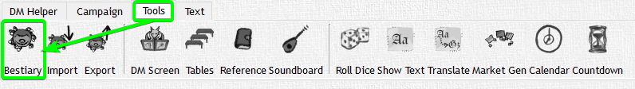
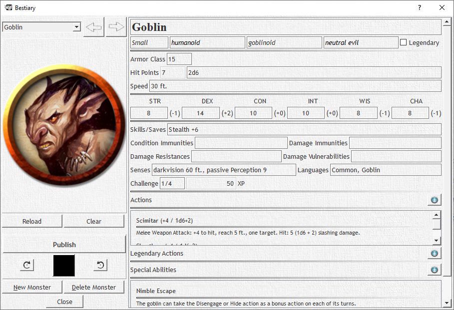
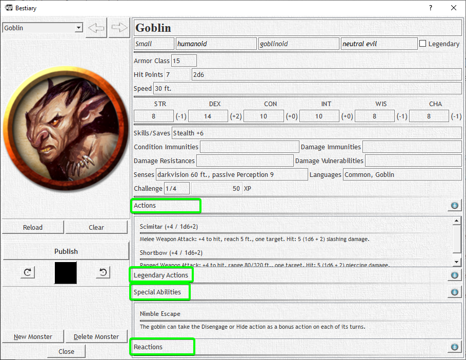

# Bestiary

The Bestiary contains stats and info for all your monsters and opponents.





The Bestiary XML consists of multiple `<element>` entries that all resemble one Monster.

```xml
<root xmlns:xsi="http://www.w3.org/2001/XMLSchema-instance" xsi:noNamespaceSchemaLocation="bestiary.xsd">
  <bestiary majorversion="100" minorversion="100">
    <element icon="pathToImage" private="0">
      ...
    </element>
  </bestiary>
</root>
```

The "pathToImage" Attribute can be a relative or absolute path to an image for the monster.

Everything contained within the element is the name, stats, actions, attacks,... of the monster.

The following values are available:

## General Information

```xml
...
<name>monster name</name>
<size>monster size (tiny, small, medium, large, huge, gargantuan)</size>
<type>monster type (best, undead, fiend,...)</type>
<subtype>monster subtype</subtype>
<alignment>monster alignment (evil, good, lawful, chaotic)</alignment>
<armor_class>10</armor_class>
<hit_dice>hit dice to roll unique hit dice (eg. 10d20+30)</hit_dice>
<hit_points>average hit points</hit_points>
<speed>speed in ft</speed>
<senses>darkvision, blindsight,...</senses>
<condition_immunities>condition immunities (poisoned, stunned,..)</condition_immunities>
<damage_immunities>damage immunities (fire, acid,..)</damage_immunities>
<damage_resistances>damage resistances (fire, acid,..)</damage_resistances>
<damage_vulnerabilities>damage vulnerabilities (fire, acid,..)</damage_vulnerabilities>
<languages>monster languages</languages>
<challenge_rating>monster challenge rating (1/2, 1/4, 5, 6,...)</challenge_rating>
...
```

## Stats

```xml
...
<strength>10</strength>
<dexterity>10</dexterity>
<constitution>10</constitution>
<intelligence>10</intelligence>
<wisdom>10</wisdom>
<charisma>10</charisma>
...
```

## Skills

```xml
...
<acrobatics>10</acrobatics>
<arcana>10</arcana>
<athletics>10</athletics>
<deception>10</deception>
<history>10</history>
<insight>10</insight>
<intimidation>10</intimidation>
<investigation>10</investigation>
<medicine>10</medicine>
<nature>10</nature>
<perception>10</perception>
<performance>10</performance>
<persuasion>10</persuasion>
<religion>10</religion>
<stealth>10</stealth>
<survival>10</survival>
...
```

## Saves

```xml
...
<strength_save>2</strength_save>
<dexterity_save>2</dexterity_save>
<constitution_save>2</constitution_save>
<intelligence_save>2</intelligence_save>
<wisdom_save>2</wisdom_save>
<charisma_save>2</charisma_save>
...
```

## Actions

There are 4 more possible elements that are identical in structure: `<actions>`, `<special_abilities>`, `<reactions>` and `<legendary_actions>`.
They are basically what the monster can do as his Actions, Reactions, etc.

```xml
...
<actions>
<element>
<attack_bonus>attack modifier</attack_bonus>
<desc>description of the action</desc>
<name>action name</name>
<damage_bonus>damage bonus (str, dex, etc.)</damage_bonus>
<damage_dice>damage dice (eg. 1d6)</damage_dice>
</element>
</actions>
...
```

As an Example - a melee Attack could look like this:

```xml
...
<actions>
<element>
<attack_bonus>4</attack_bonus>
<desc>Melee Weapon Attack: +4 to hit, reach 5 ft., one target. Hit: 5 (1d6+2) piercing damage.</desc>
<name>Shortsword</name>
<damage_bonus>2</damage_bonus>
<damage_dice>1d6</damage_dice>
</element>
</actions>
...
```

Depending on what tag you use it will show up in different spots on the Monster Page


