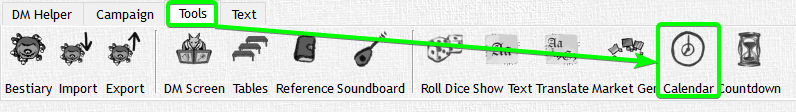
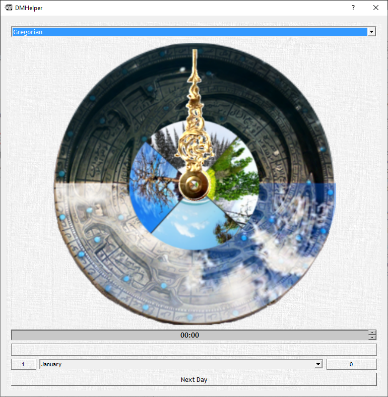

# Calendar [calendar.xml]

The calendar File contains the Data that is shown within the Calendar Dialog of DMHelper.




Minimal Example:

```xml
<root xmlns:xsi="http:<area />//www.<area />w3.org/2001/XMLSchema-instance" xsi:noNamespaceSchemaLocation="calendar.xsd">
  <calendar name="Gregorian" weeklength="7">
    <month name="January" days="31"/>
  </calendar>
</root>
```

This contains only one Calendar named "Gregorian" with a week length of 7 days. It contains only one month named "January" that has 31 days.

You can Copy the `calendar` element as many times as you want. Just name them individually to find them later in DMHelper.

Example with 2 Calendars:

```xml
<root xmlns:xsi="http:<area />//www.<area />w3.org/2001/XMLSchema-instance" xsi:noNamespaceSchemaLocation="calendar.xsd">
  <calendar name="Gregorian" weeklength="7">
    <month name="January" days="31"/>
  </calendar>
  <calendar name="Other Calendar" weeklength="7">
    <month name="Firstmonth" days="20"/>
    <month name="Secondmonth" days="77"/>
  </calendar>
</root>
```

This would show up in DMHelper as 2 Calendars where the second Calendar has 2 months where "Firstmonth" has 20 days and "Secondmonth" has 77.
