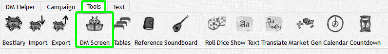
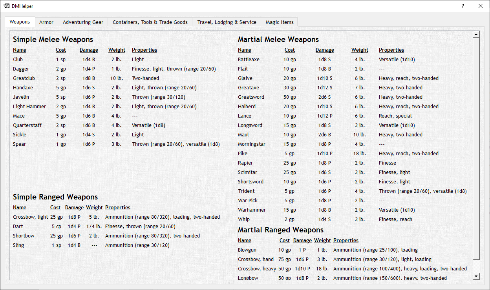
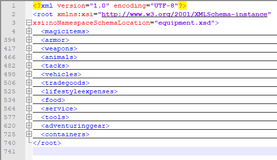
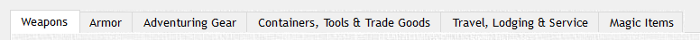
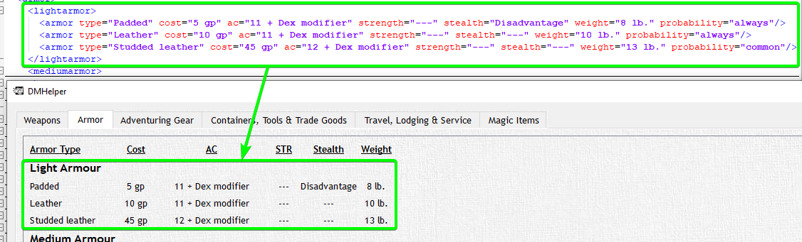
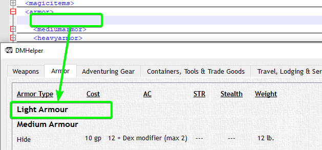

# DM Screen [equipment.xml]

The equipment File contains the contents shown in the DM Screen

This file is a bit bigger and more involved as it contains a bunch of information. This is where Editors like Notepad++ come in handy.
When you open an XML File you will see plus and minus symbols on the left border. Clicking them can expand and collapse elements to make it easier to get an overview and not having to scroll all over the document.

The base structure looks like this:

Here the Sub-Elements are folded in for a bit better overview. Where the horizontal lines are is where all the contents of those Sub-Elements would be.

You will recognize that those correspond to the respective Tabs in the DM Screen in DMHelper

They are not necessarily in the same order and some of the Sub-Elements are accumulated within one single Tab but the contents of the Sub-Elements correspond 1:1 with the contents of the Tabs.
As example in the image above the Light Armor section

The headers are an example of structure that you can't (yet) change. Deleting the light armor section would just result in an empty heading within DMHelper as it is hardcoded:

This holds true for the rest of the file as well. The easiest way is to work with the innermost subelements and to leave most of the outer structure as is.

Be aware that entries in this file will also be pulled for generating Shops / Markets. More Details are in the Market Generator File Section.

Going over every single element in this file would overstretch the context of this Documentation but with try and error you should get fast results (Don't forget to backup your xml file). Don't hesitate to ask us if you have troubles editing the File.
