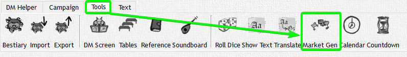
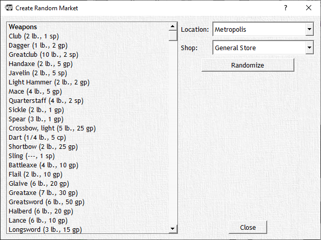

# Market Generator [shops.xml]





Minimum File:

```xml
<root xmlns:xsi="http://www.w3.org/2001/XMLSchema-instance" xsi:noNamespaceSchemaLocation="shops.xsd">
  <locations>
    <location name="Metropolis" probability="10.0">
      <shop name="General Store" mundane="1.0" goods="1.0" magic_armor="0.1" magic_potion="0.5" magic_ring="0.1" magic_rod="0.1" magic_scroll="0.1" magic_staff="0.1" magic_wand="0.1" magic_weapon="0.1" magic_wondrousitem="0.1" vehicles="0.1" weapon="0.5" armor="0.5"/>
    </location>
  </locations>
</root>
```

The `<location>` element can be seen as a grouping of different shops. In this case used to define what shops would occur in which size of cities.

This is ofc not limited to size - you could just as well impose geographical groupings as well as any other criteria that you can think of. The "probability" Attribute is a multiplier that is applied to the probabilities of each Item-Type-Attribute of the shops.

The `<shop>` element has one "name" attribute and multiple Item-Type-Attributes that set the respective probability for each Item-Type. A 0 meaning 0% chance of occurring in this shop, a 1 meaning 100% chance of occurring in the shop. You can ofc set any value in between. Remember that the probability also gets multiplied by the location multiplier.

reduced Example:

```xml
<location name="Example" probability="0.5">
  <shop name="General Store" mundane="1.0" goods="0.5"/>
</location>
```

This means that combining the probability of the location and the shop: in this example "mundane" Items result in a total chance of 1.0 x 0.5 = 0.5 (=50%) and "goods" have a total chance of 0.5 x 0.5 = 0.25 (=25%) of occuring.

The items that can occur are pulled from the equipment.xml File from the respective sections. For example `magic_weapon` Item-Type would come from the `<magicitems>` section where the category of a magic item contains the keyword "Weapon".
"goods" corresponds to the `<tradegoods>` sections and so on.
