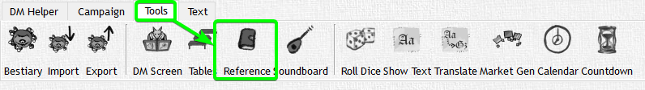
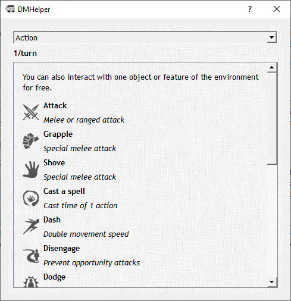
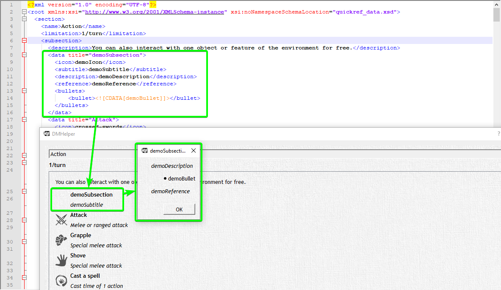
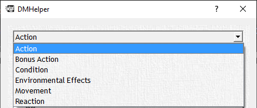
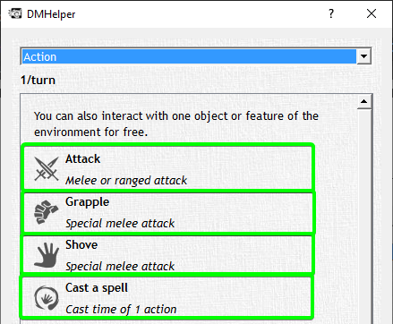
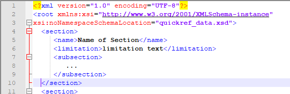
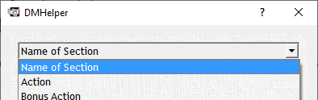
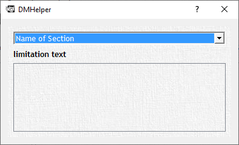
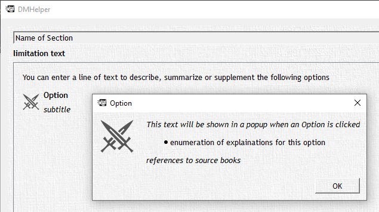

# Reference [quickref\_data.xml]

export const LightHighlight = ({children, color}) => (
  <span
    style={{
      backgroundColor: color,
      borderRadius: '2px',
      color: '#1f1f1f',
      padding: '0.2rem',
    }}>
    {children}
  </span>
);

This file contains the data for the "Reference" Window in DMHelper.





Most of this file is pretty tightly integrated with DMHelper at the moment. So while you can still add content as far as text goes the icons are currently compiled into the app itself.

An example of an addition in the XML and the results of those entries

```xml
<data title="demoSubsection">
  <icon>demoIcon</icon>
  <subtitle>demoSubtitle</subtitle>
  <description>demoDescription</description>
  <reference>demoReference</reference>
  <bullets>
    <bullet><![CDATA[demoBullet]]></bullet>
  </bullets>
</data>
```



A special mention here would be that the text content of the bullets has to be wrapped in a special CDATA section. Meaning "character data" that can contain characters like `<` or `>` which would otherwise be reserved for xml tags. This enables the use of formatting tags like `<b>` for bold text, `<i>` for italic text and `<u>` for underlined text.
Make sure that you put `<![CDATA[` at the beginning of the text and `]]` at the end of it

<LightHighlight color="yellow">&lt;![CDATA[</LightHighlight> <LightHighlight color="lime">this text can contain &lt; and &gt; without being a problem</LightHighlight> <LightHighlight color="yellow">]]</LightHighlight>

<br />
<br />

You can either edit `<sections>` that correspond with the items in the drop down list



or `<subsections>` that correspond to the items within a section



## Section

Sections have a name, a limitation text and a subsection that contains all the Options for the section.

```xml
<section>
  <name>Name of Section</name>
  <limitation>limitation text</limitation>
  <subsection>
    ...
  </subsection>
</section>
```





This gives you a new entry in the dropdown list...



...but no Options for this Choice yet. For that you need to add the Options via a subsection.

## Sub Section

The subsection contains all the Options that are shown when Choosing a Section (the surrounding `<section>` element has been omitted for clarity)

```xml
...
  <subsection>
    <description>You can enter a line of text to describe, summarize or supplement the following options</description>
    <data title="Option">
        <icon>crossed-swords</icon>
        <subtitle>subtitle</subtitle>
        <description>This text will be shown in a popup when an Option is clicked</description>
        <reference>references to source books</reference>
        <bullets>
        <bullet><![CDATA[enumeration of explainations for this option]]></bullet>
        </bullets>
    </data>
  </subsection>
...
```



Example of the Result that the Addition produces.

:::note

Icons are compiled into the app itself and can not (yet) be supplied by yourself. Though you can use the included ones no problem.

:::
