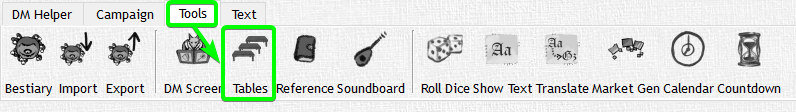
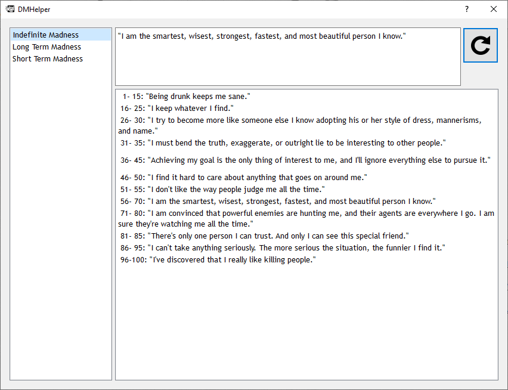
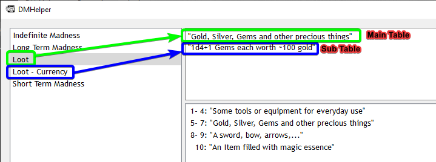

# Tables

Since there can be multiple tables they are not bound to a single File. Instead you configure a Path to a Folder within DMHelper Options that contains multiple xml-files -> your tables.





Minimum File:

```xml
<dmhelperlist name="tablename" xmlns:xsi="http://www.w3.org/2001/XMLSchema-instance" xsi:noNamespaceSchemaLocation="table.xsd">
  <entry>"Option"</entry>
</dmhelperlist>
```

Be careful to give each table you create a unique `name` (the given name of the example here is `tablename`).

## Weights

For the following examples i am omitting the encapsulating `<dmhelperlist>` element to save on space and make things more clear. In the actual file it still needs to be present of course.

A list with 3 equally likely options would look like this

```xml
<entry>Item 1</entry>
<entry>Item 2</entry>
<entry>Item 3</entry>
```

To make things less random and to give maybe Item 1 a better chance of showing up you can add weights to the entries.

```xml
<entry weight="3">Item 1</entry>
<entry>Item 2</entry>
<entry>Item 3</entry>
```

This way Item 1 is 3x as likely to show up in comparison to Item 2 or 3. You can add those weights only to those items that you want to show up more often or you can also add weights to all of the Items as well.

```xml
<entry weight="3">Item 1</entry>
<entry weight="4">Item 2</entry>
<entry weight="1">Item 3</entry>
```

The most likely item to show up here is Item 2, followed by Item 1 with Item 3 being the lowest chance item.

## Subtables

What if, when one item in a table gets chosen, you want another table triggered that again gets rolled on.

How about loot in a chest. You have one table that decides the type of Item

```xml
<dmhelperlist name="Loot" xmlns:xsi="http://www.w3.org/2001/XMLSchema-instance" xsi:noNamespaceSchemaLocation="table.xsd">
  <entry weight="4">"Some tools or equipment for everyday use"</entry>
  <entry weight="3">"Gold, Silver, Gems and other precious things"</entry>
  <entry weight="2">"A sword, bow, arrows,..."</entry>
  <entry weight="1">"An Item filled with magic essence"</entry>
</dmhelperlist>
```

But which tool? How much gold? Sword or Bow?
That is where subtables come in.

```xml
<dmhelperlist name="Loot" xmlns:xsi="http://www.w3.org/2001/XMLSchema-instance" xsi:noNamespaceSchemaLocation="table.xsd">
  <entry weight="4" subtable="Loot - General Items">"Some tools or equipment for everyday use"</entry>
  <entry weight="3" subtable="Loot - Currency">"Gold, Silver, Gems and other precious things"</entry>
  <entry weight="2"subtable="Loot - Weapon">"A sword, bow, arrows,..."</entry>
  <entry weight="1" subtable="Loot - Magic Items">"An Item filled with magic essence"</entry>
</dmhelperlist>
```

With those added DMHelper will search for other tables in your tables-Folder that have the given name and roll a value on those to display as well. A subtable looks exactly like a normal table - the only thing that has to be taken care of is the right name.

```xml
<dmhelperlist name="Loot - Currency" xmlns:xsi="http://www.w3.org/2001/XMLSchema-instance" xsi:noNamespaceSchemaLocation="table.xsd">
  <entry weight="4">"10d20+30 Copper"</entry>
  <entry weight="3">"8d20+20 Silver"</entry>
  <entry weight="2">"5d20+10 Gold"</entry>
  <entry weight="1">"1d4+1 Gems each worth ~100 gold"</entry>
</dmhelperlist>
```



Whenever you roll on the Main List DMHelper will automatically roll on the subtable as well.

Here the "Loot" Table rolled the second Option "Gold, Silver, Gems and other precious things". Since it was connected to a Subtable it automatically rolled on the "Loot - Currency" Table as well and brought up some shiny Gems to give out to your Players.

Can Subtables have Subtables? Yes!
There is practically no limit to how deep you can go with your subtables.

It is a very nice way to introduce some randomness and sometimes creative outcomes for certain situations.
