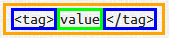
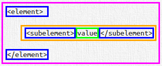
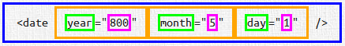

# XML - The Basics

import {LightHighlight, DarkHighlight} from "@site/src/components/highlight";

At its base XML is a File that has a certain structure that is humanly readable and also readable for DMHelper. Don't worry it won't be long - we just want you to know what we're talking about when using certain terms and you getting a feeling for what you are doing.

Every XML-File starts with this Line: `<?xml version="1.0" encoding="UTF-8"?>`

You can pretty much ignore it as this only defines the File as being an XML-File. It is a standard that everybody should follow but that doesn't change the actual content.

After that you will see what is called a `root`-Element.

```xml
<root>
    ...
</root>
```

Sometimes it is even named `root` but it can be whatever fits best. The important thing is that there can only ever be **one (!)** root Element. So if you copy stuff around be sure that you copy it into the right place. Appending stuff just at the end of the File won't work. It has to be within the root element at the right place.

The root Element will contain some Attributes that help with validating the Files which is not something that you will do.

<!-- markdownlint-disable MD033 Exception to Rule MD033 needed for highlights -->
<!-- area tags in link to force no auto linking on website -->
`<root` <LightHighlight color="yellow">xmlns:xsi="http:<area />//www.<area />w3.org/2001/XMLSchema-instance" xsi:noNamespaceSchemaLocation="equipment.xsd"</LightHighlight> `>`
<!-- markdownlint-enable MD033 -->

You can safely ignore those Attributes, but they will be included in the code examples for completeness sake.

## Elements

An Example for an Element in XML would be: `<tag>value</tag>`

<!-- markdownlint-disable MD033 Exception to Rule MD033 needed for highlights -->
An <LightHighlight color="orange">Element</LightHighlight> in XML contains <DarkHighlight color="blue">Tags</DarkHighlight> that mark the name of a <LightHighlight color="lime">Value</LightHighlight> that DMHelper can then apply within the app.
<!-- markdownlint-enable MD033 -->



The Value can be any text you like with the exception of a few characters like `<` and `>` as those would be interpreted as the start or the end of another Tag. If you don't feel like looking through all your text you can use free online formatters that will take care of this automatically (eg. [https://www.freeformatter.com/xml-escape.html](https://www.freeformatter.com/xml-escape.html))

## Subelements

Elements can also act as Container and contain Sub-Elements

```xml
<element>
  <subelement>value</subelement>
</element>
```



<!-- markdownlint-disable MD033 Exception to Rule MD033 needed for highlighting -->
The <LightHighlight color="magenta">"parent-Element"</LightHighlight> still uses <DarkHighlight color="blue">Tags</DarkHighlight> but instead of a plain Text as a <LightHighlight color="lime">Value</LightHighlight> there now is another <LightHighlight color="orange">"Sub-Element"</LightHighlight> or also called <LightHighlight color="orange">"Child-Element"</LightHighlight>.
<!-- markdownlint-enable MD033 -->

You will also note that the Sub-Element is on a separate Line. This has no functional implications for the XML-File. The only place where you need to be careful with new-lines is with the Values.

The Example with the Sub-Element could therefore also have been written like this:

```xml
<element><subelement>value</subelement></element>
```

But not like this:

```xml
<element><subelement>val
ue</subelement></element>
```

<!-- markdownlint-disable MD033 Exception to Rule MD033 needed for highlighting -->
| Tags | Description |
| :---: | --- |
| <DarkHighlight color="blue">&lt;tag&gt;</DarkHighlight><LightHighlight color="cornflowerblue">&lt;/tag&gt;</LightHighlight> | Every Element has an <DarkHighlight color="blue">opening Tag</DarkHighlight> and a <LightHighlight color="cornflowerblue">closing Tag</LightHighlight> |
| <DarkHighlight color="blue">&lt;tag /&gt;</DarkHighlight> | If an Element contains no value it can be shortened to a special "empty" Tag Notation |
<!-- markdownlint-enable MD033 -->

These 2 ways are functionally exactly the same.

## Attributes

```xml
<date year="800" month="5" day="1" />
```

<!-- markdownlint-disable MD033 Exception to Rule MD033 needed for highlighting -->

A <DarkHighlight color="blue">Tag</DarkHighlight> can have <LightHighlight color="orange">Attributes</LightHighlight> that have a <LightHighlight color="lime">name</LightHighlight> and a <LightHighlight color="magenta">value</LightHighlight>:

<!-- markdownlint-enable MD033 -->



Make sure to only edit the value within the quotes as they mark the beginning and end of a value.

There can also be mixtures where an Element/Tag has Attributes and Values:

```xml
<element attributeName="attributeValue">elementValue</element>
```

:::tip

No worries, this probably sounds pretty complicated. It's mostly because this is very condensed and short info about the Parts of XML. But rest assured - you probably won't write the XML structure yourself but you will rather copy what is already there and adjust where needed. So you won't need that deep of an understanding of XML to make your own changes.

:::
